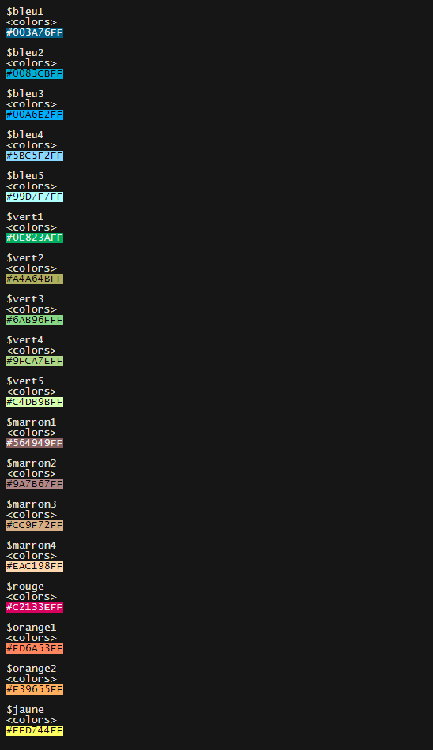
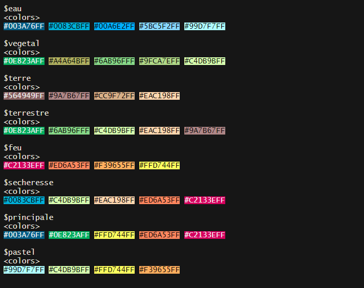

```{r, include = FALSE}
knitr::opts_chunk$set(
  collapse = TRUE,
  comment = "#>",
  fig.width = 6,
  fig.height = 4
)
```

## Setup

## Installation
```{r}
if (!require(remotes))
    install.packages("remotes")

if (!require(templatesOFB))
    remotes::install_gitlab(
        repo = "cedric.mondy1/templatesofb",
        host = "https://gitlab.afbiodiversite.fr", 
        dependencies = TRUE
        )

if (!require(ggplot2))
    install.packages("ggplot2")
if (!require(magrittr))
    install.packages("magrittr")

`%>%` <- magrittr::`%>%`

```


## Chargement

```{r setup}
library(ggplot2) # faire les graphiques
library(templatesOFB)
```

## Produire un graphique simple avec {ggplot2}
```{r}
# le jeu de données iris est disponible dans l'installation de base de R
gg <- ggplot(
    data = iris, 
    mapping = aes(
        x = Sepal.Width, 
        y = Sepal.Length, 
        color = Species
        )
    ) +
    geom_point(size = 4)

gg
```

## Utilisation des couleurs de la charte graphique

```{r, eval=FALSE}
ofb_colors %>% 
    lapply(prismatic::color)
```


Plusieurs palettes proposées à partir de ces couleurs
```{r, eval=FALSE}
ofb_palettes %>% 
    lapply(prismatic::color)
```


```{r}
gg +
    scale_color_ofb(palette = "terrestre")
```

## Mise en page du graphique

### Application d'un thème
```{r}
gg_ofb <- gg +
    scale_color_ofb(palette = "principale") +
    theme_ofb()

gg_ofb
```

### Mise en page
```{r}
gg

compose_ofb(gg_ofb, src_size = 3, src = c("OFB"))


```
